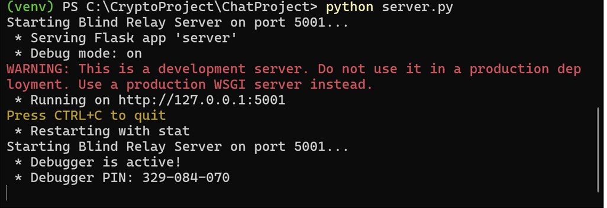
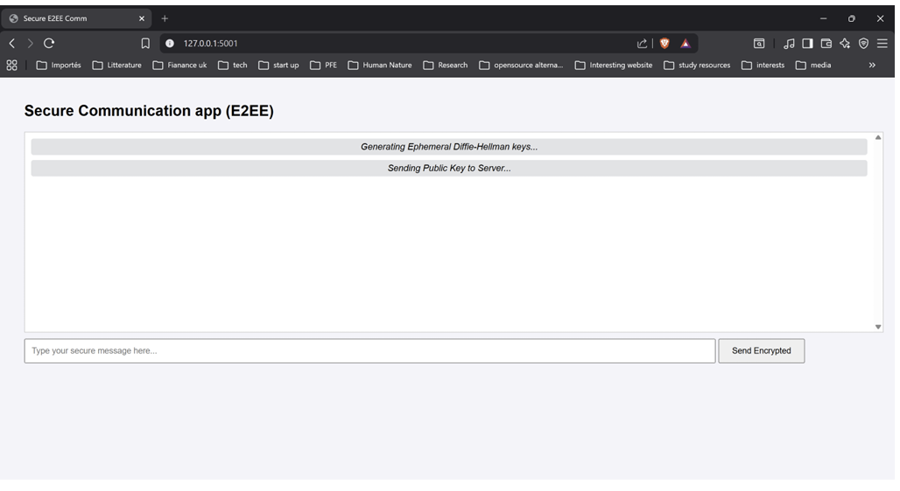
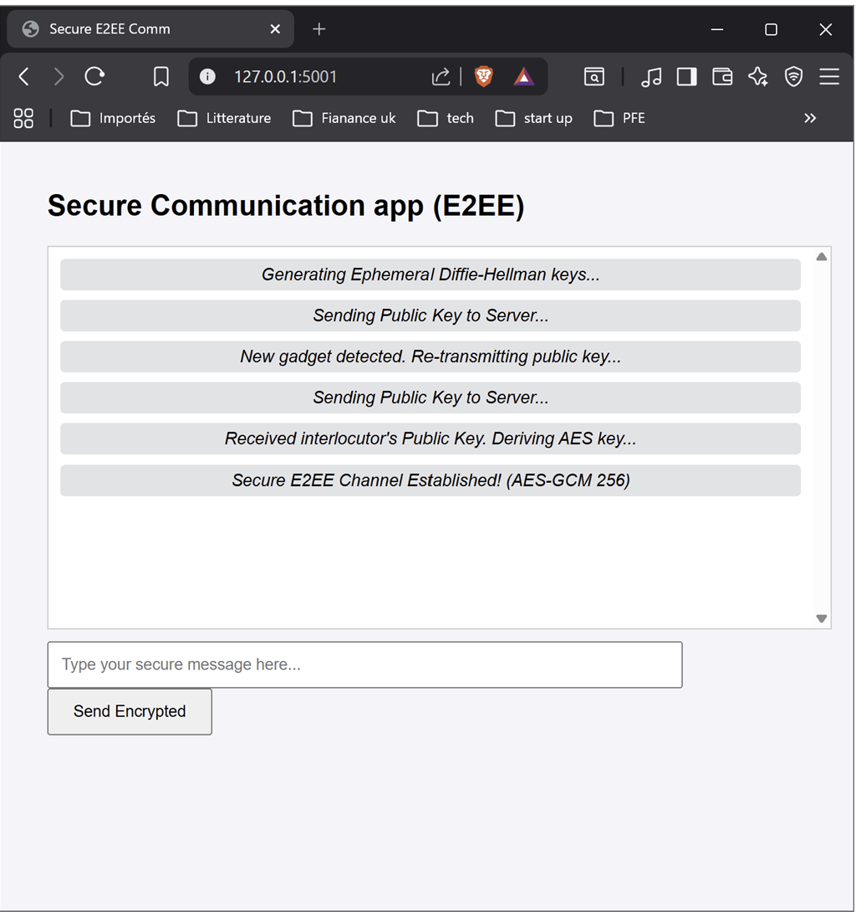
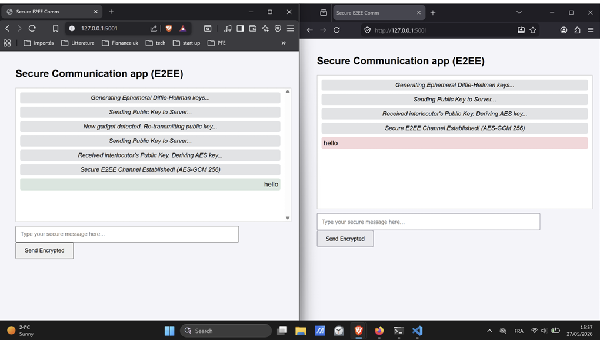
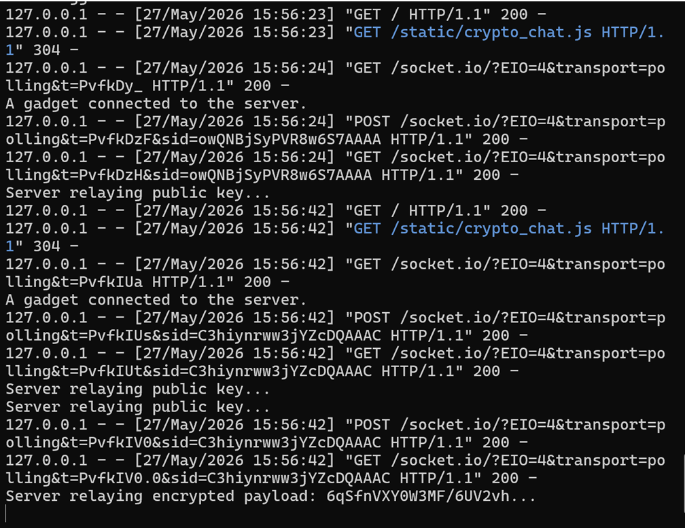
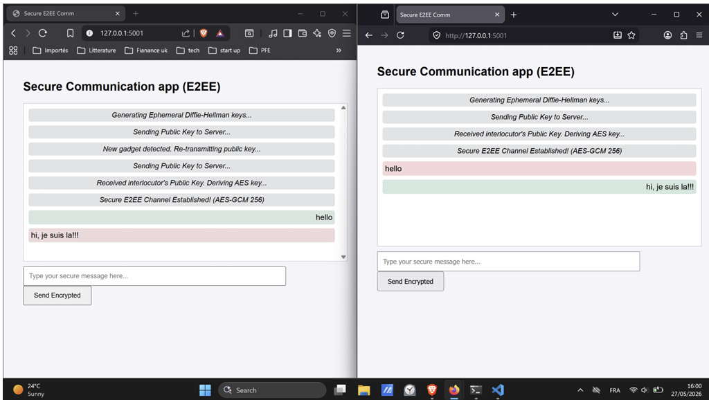
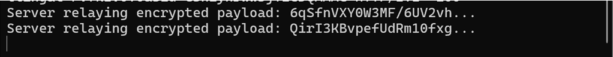

# End-to-End Encrypted (E2EE) Chat Application

A secure two-client chat application demonstrating **End-to-End Encryption (E2EE)** over a local network.

## 🔐 Security Objectives

The project is designed around:

* **Confidentiality** — messages are encrypted before leaving the client.
* **Integrity** — AES-GCM authentication detects message modification.
* **Key Exchange** — ECDH P-256 allows both clients to derive a shared secret.
* **Blind Relay** — the server forwards encrypted payloads without decrypting them.
* **Unique IVs** — every message uses a fresh 12-byte initialization vector.

> **Note:** For a production E2EE system, authenticated public-key verification and explicit replay protection would also be required.

## 🏗️ Architecture

Two independent browsers represent the two communication endpoints:

```text
        Client A                         Client B
     Brave/Chromium                    Firefox
          │                                ▲
          │                                │
          │       Encrypted JSON           │
          ▼                                │
     ┌─────────────────────────────────────────┐
     │        Flask-SocketIO Relay             │
     │            localhost:5001               │
     │                                         │
     │       Blind / Untrusted Server          │
     └─────────────────────────────────────────┘
```

The server only relays:

```text
Encrypted JSON → Server → Encrypted JSON
```

It does not perform encryption or decryption.

## 🛠️ Technologies

* **Python**
* **Flask**
* **Flask-SocketIO**
* **JavaScript**
* **Web Crypto API**
* **ECDH P-256**
* **AES-GCM 256**
* **WebSockets**
* **JSON / Base64**
* **Brave / Chromium**
* **Mozilla Firefox**

# 🧪 Demonstration & Testing

The following tests were performed locally.

### 1. Server Initialization

Flask-SocketIO server running on port `5001`.




### 2. Client A — Key Generation

Client A generates an ephemeral ECDH P-256 key pair using the Web Crypto API.




### 3. Client B — Shared Key Derivation

Client B connects and derives the AES-GCM-256 encryption context.


### 4. Client A — Handshake Verification

Client A detects Client B, exchanges public keys and completes the cryptographic handshake.



### 5. Encrypted Message

Client A sends:

```text
hello
```

The message is encrypted locally before transmission.



### 6. Blind Relay Verification

The server receives only encrypted ciphertext rather than plaintext.

Example:

```text
6qSfnVXY...
```



### 7. Bidirectional Communication

Client B replies:

```text
hi, je suis la!!!
```

The message is encrypted by Client B and decrypted locally by Client A.



### 8. Final Server State

Different messages produce distinct ciphertexts due to the use of fresh IVs.




# 🎥 Demo Video

A complete demonstration of the application is available here:

**[▶️ Watch the E2EE Chat Demo](VIDEO_LINK_HERE)**

If the video is stored directly in this repository, replace the link above with the path to the uploaded video.

## 📌 Security Demonstration

The project demonstrates the following communication model:

```text
              ENCRYPTION                    DECRYPTION

Client A ────────► Ciphertext ────────► Client B
                    │
                    ▼
              Flask-SocketIO
                 Relay Only

              ❌ No plaintext
              ❌ No AES key
              ❌ No private ECDH keys
```

The core principle is:

> **The clients encrypt and decrypt. The server only relays.**

## ⚠️ Project Scope

This is an **educational E2EE demonstration** running locally.

For production deployment, additional security mechanisms should be implemented, including:

* authenticated public-key verification;
* explicit replay protection;
* secure session/key management;
* HTTPS/WSS;
* stronger endpoint security.


## 📄 License

Add your chosen license here.
